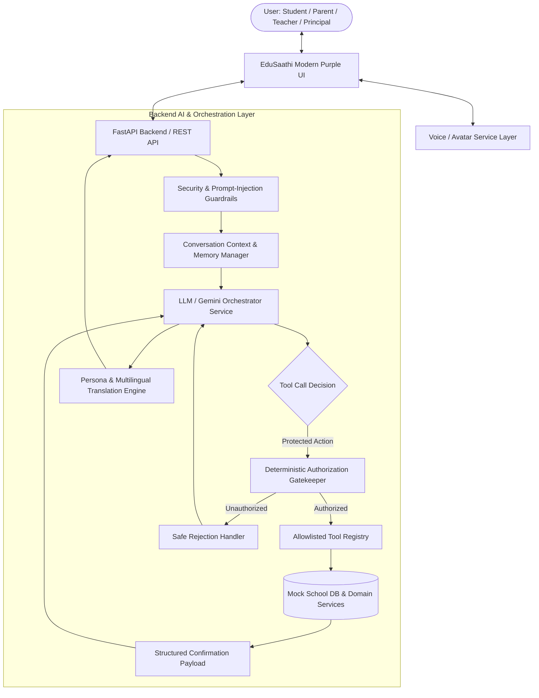

# EduSaathi (एडूसाथी)
> **"The Operating System Your School Needs"**
> 
> *A Human-Like AI School Assistant & Operating System built for the Bharat Academix AI & Machine Learning Competition 2026.*

---

## View Live Demo (LINK) :

👉 **[https://edusaathi-frontend-l3hi.onrender.com/](https://edusaathi-frontend-l3hi.onrender.com/)**

Experience the EduSaathi platform with role-based dashboards for Students, Parents, Teachers, and Principals.

---

## Overview

**EduSaathi** is an intelligent, multi-persona AI School Operating System designed to bridge the communication and workflow gap between students, parents, teachers, and school leadership. Unlike superficial chatbots that offer pre-scripted canned answers or hallucinate administrative changes, EduSaathi employs a **deterministic application-level authorization matrix**, **orchestrated tool-calling agent architecture**, **conversational context memory**, **multilingual Indian language support (11 languages)**, **voice interaction**, and a **persona-aware AI avatar**.

---

##  Key Capabilities

- **4 Context-Aware Personas**:
  -  **Student Persona** (*EduSaathi Academic Assistant*): Friendly, student-focused, personal academic queries & attendance.
  -  **Parent Persona** (*EduSaathi Parent Support Assistant*): Caring, reassuring, tracks authorized child's progress, teacher call requests.
  -  **Teacher Persona** (*EduSaathi Teaching Assistant*): Professional, attendance marking with verification, classroom summaries.
  -  **Principal Persona** (*EduSaathi Management Assistant*): Executive, school-wide analytics, metrics, management actions.
- **Strict Application-Level Authorization**: Direct `authorize_action(user, action, resource)` checks prior to tool execution—the LLM is never trusted to make authorization decisions or execute arbitrary database operations.
- **Verified Action Execution**: AI never claims an action succeeded unless mock domain services return verified confirmation (`success: true`).
- **11 Indian Languages**: Supports **English, Hindi, Tamil, Telugu, Marathi, Bengali, Gujarati, Punjabi, Kannada, Malayalam, and Urdu**.
- **Voice + AI Avatar** — Interactive **voice input, text-to-speech, and persona-aware avatar** with real-time interaction states.
- **Modern School Dashboard** — Clean, **purple-first UI** designed for an intuitive school management experience.

---

##  System Architecture



---
## 📸 Demo Screenshots

The following screenshots showcase the main user interfaces and role-based access features of EduSaathi.

### 🔐 Role-Based Login

The login page provides secure role-based authentication for Students, Parents, Teachers, and Principals. Each user is redirected to a personalized dashboard according to their authorized role.


---

### 🎓 Student Dashboard

The Student Dashboard provides students with a personalized view of their academic information, attendance, activities, and AI-powered academic assistance.


---

### 👨‍👩‍👦 Parent Dashboard

The Parent Dashboard allows parents to monitor their child's academic progress, attendance, and other important school-related information through a dedicated interface.


---

##  Tech Stack

- **Frontend**: React 18 / 19, Vite, Tailwind CSS (Purple-first design system), Lucide Icons.
- **Backend**: Python 3.11+, FastAPI, Pydantic v2, Uvicorn.
- **AI & Reasoning**: Google Gemini API / LLM Service abstraction with structured tool-calling.
- **Testing**: Pytest with automated authorization, mock services, and security tests.

---

##  Getting Started

### Prerequisites
- **Node.js**: v18+ and npm
- **Python**: 3.11+
- A **Gemini API key** (free tier is fine) from [Google AI Studio](https://aistudio.google.com/app/apikey) — required for real AI chat; the app runs without one but falls back to a deterministic demo responder (see [AI Architecture](#-ai--llm-architecture) below).

### 1. Backend Setup

```bash
# Navigate to backend directory
cd backend

# Create and activate virtual environment
python -m venv venv
# On Windows:
.\venv\Scripts\activate
# On Linux/macOS:
source venv/bin/activate

# Install dependencies
pip install -r requirements.txt

# Configure environment variables
cp .env.example .env
# then open backend/.env and paste your key into GEMINI_API_KEY= (see below)

# Run FastAPI server (the SQLite database is auto-created and seeded on first run)
uvicorn app.main:app --reload --port 8000
```
Backend will be live at `http://127.0.0.1:8000` (API Docs at `/docs`, Health Check at `/api/health`).

### 2. Frontend Setup

```bash
# Navigate to frontend directory
cd frontend

# Install dependencies
npm install

# Configure environment variables (only needed if backend isn't on the default port/host)
cp ../.env.example .env   # or create frontend/.env with VITE_API_BASE_URL

# Run Vite development server
npm run dev
```
Frontend will be live at `http://localhost:5173`.

---

## 🔑 Environment Variables & Where to Put Your Gemini Key

There are two `.env.example` files — copy each to `.env` in the same folder (both are gitignored, so your real keys never get committed):

**`backend/.env`** (the one that matters for AI):
```bash
# Get a free key at https://aistudio.google.com/app/apikey
GEMINI_API_KEY=your_gemini_api_key_here      # <-- PASTE YOUR KEY HERE
GEMINI_MODEL=gemini-2.5-flash

SECRET_KEY=edusaathi_development_secret_key_change_in_production   # change for any real deployment
DATABASE_URL=sqlite:///./edusaathi.db
APP_ENV=development
```

**`.env`** (project root, read by the frontend build via Vite):
```bash
VITE_API_BASE_URL=http://127.0.0.1:8000
ALLOWED_ORIGINS=http://localhost:5173,http://127.0.0.1:5173
```

⚠️ **Never commit a real key inside a `.env.example` file** — those files are meant to be checked into git as templates. Only the actual `.env` files (which are gitignored) should hold real secrets.

Without a Gemini key, the backend automatically serves chat through a deterministic fallback responder — so the app is still fully demoable offline or if the key hits a quota limit — but you'll want a real key connected for the live judged demo, since that's what exercises real LLM tool-calling.

---

## 🗄️ Database Setup

EduSaathi uses **SQLite** (`backend/edusaathi.db`) with **SQLAlchemy** — zero external setup required.

- The database file and all tables are created automatically on first backend startup.
- Realistic demo data (4 personas × several students/classes, attendance history, grades, and one seeded escalation ticket) is seeded automatically the first time the app runs, via `app/database/seed.py`.
- To reset to a clean seeded state at any point:
  ```bash
  cd backend
  rm edusaathi.db        # Windows: del edusaathi.db
  uvicorn app.main:app --reload --port 8000    # re-seeds automatically on startup
  ```
- To swap to Postgres/Supabase later (e.g. for a real deployment), only `DATABASE_URL` in `backend/.env` needs to change — the SQLAlchemy models are database-agnostic.

---

##  Demo Accounts

Seeded automatically — use these to log in and test each role and the RBAC boundaries between them:

| Role | Email | Password | Notes |
|---|---|---|---|
| Student | `student@edusaathi.demo` | `student123` | Rahul Sharma, Class 10-A |
| Parent | `parent@edusaathi.demo` | `parent123` | Sanjay Sharma — linked to Rahul only |
| Teacher | `teacher@edusaathi.demo` | `teacher123` | Ms. Anjali Sharma, assigned to Class 10-A |
| Principal | `principal@edusaathi.demo` | `principal123` | Dr. Vikram Rao — school-wide access |

A second parent (`meera.deshmukh@edusaathi.demo` / `parent123`) and second student (`ananya@edusaathi.demo` / `student123`) are also seeded specifically to demonstrate that **a parent cannot view a different family's child's records** — try logging in as the first parent and asking about a different student to see the RBAC denial in action.

---

##  AI / LLM Architecture

EduSaathi never lets the LLM touch the database directly. The flow is:

```
User message (chat or voice)
    │
    ▼
LLMService.chat()  ── builds a role- and language-aware system prompt,
    │                  declares only role-appropriate tools to Gemini
    ▼
Gemini decides: reply directly, OR request a tool call
    │
    ▼ (if tool requested)
ToolDispatcher.dispatch()  ── the ONLY component allowed to query the DB.
    │                          Re-checks AuthorizationService.authorize()
    │                          independently of what the LLM assumed —
    │                          a compromised or confused model still
    │                          cannot read/write data it isn't allowed to.
    ▼
Tool result (or an authorization-denial payload) fed back to Gemini
    │
    ▼
Gemini composes the final natural-language reply, in the selected language
```

**Fallback mode:** if `GEMINI_API_KEY` is unset, invalid, rate-limited, or unreachable (e.g. no internet), `chat.py` automatically falls back to a deterministic keyword-based responder (`generate_persona_response`) so the demo never goes fully blank. The API response includes an `"engine"` field (`"gemini"`, `"gemini_partial"`, or `"fallback"`) so you can see which path served any given reply — useful for the judging demo.

**Language coverage:** the Gemini path has full system-prompt instructions for all 11 required languages (`backend/app/services/llm_service.py`, `LANGUAGE_INSTRUCTION`) — connect a real key and any of the 11 will get a natively-translated AI reply. The offline fallback responder covers English, Hindi, Marathi, and Tamil as a representative subset for demo purposes without a live key; the remaining 7 fall back to English text in fallback-only mode. All UI chrome (buttons, labels, navigation) is fully translated in all 11 languages regardless of AI engine.

**Security details** — prompt-injection resistance, role-spoofing defenses, and the full authorization matrix — are documented in [`SECURITY.md`](./SECURITY.md).

---

##  Voice & Avatar Pipeline

Voice uses the browser's built-in **Web Speech API** — no paid service, no extra setup:

```
Mic tap → SpeechRecognition (STT) → sendToAssistant() [same pipeline as text chat]
  → backend (LLM + tool calling) → reply text → SpeechSynthesisUtterance (TTS) → Avatar
```

The voice modal and the text chat share **one conversation** (same backend `session_id`), so a question asked by voice and a follow-up typed in chat stay in the same context — this was a deliberate integration fix: the voice modal used to just drop the transcript into the text box for the user to send manually. It now sends automatically on a final transcript, speaks the reply aloud, and animates the avatar through `listening → thinking → speaking` states tied to the real request lifecycle (not fixed timers).

Browser support: Chrome, Edge, and Safari support the Web Speech API; Firefox does not — the app degrades gracefully to text-only if `SpeechRecognition` is unavailable.

---

##  Repository Structure

This ships as a single unified app (`backend/` + `frontend/`) with role-based routing (`student`/`parent`/`teacher`/`principal` views inside one React app and one FastAPI service), rather than five separate repos, as a deliberate scoping decision given the assessment timeline. This is architecturally equivalent — role isolation is enforced at the authorization layer regardless of how the frontend is split into repos — and would split cleanly into the assessment's suggested 5-repo layout (`student-portal`, `parent-portal`, `management-portal`, `staff-portal`, `xyz-ai`) if needed, since the frontend components are already organized by feature (`components/attendance`, `components/academics`, etc.) and the AI logic is already isolated in `backend/app/services/` + `backend/app/tools/`.

---

##  Known Limitations / Future Work

- Full native-language AI replies for all 11 languages require a live Gemini connection (see Language Coverage above) — the offline fallback covers 4.
- The AI avatar is a stylized animated SVG rather than a photorealistic lip-synced avatar (e.g. D-ID/HeyGen) — a deliberate scoping choice given the timeline; the state machine (idle/listening/thinking/speaking/error) is fully real and driven by the actual request lifecycle.
- Escalation tickets ("Talk to Teacher" / "Contact School Management") are logged to the database with real ticket IDs but do not trigger an actual phone call or SMS — this is explicitly a mock service, consistent with the assessment's "communicate with mock APIs" requirement.
- Single unified repo/app rather than 5 separate portal repos (see Repository Structure above).

---

##  Running Tests

```bash
cd backend
python -m pytest tests -v
```

Covers: RBAC boundary enforcement (student/parent/teacher/principal), resource-ownership checks (a parent cannot view another family's child), chat-endpoint authentication requirements, and the chat pipeline rejecting unauthorized actions requested through natural language (e.g. a student asking the AI to mark attendance).

```bash
cd frontend
npm run build
```
Verifies the production build compiles cleanly.

---

##  Deployment

This repo is structured for local verification first. Once you've confirmed everything works locally:
- **Backend**: any Python host that supports FastAPI/Uvicorn (Render, Railway, Fly.io, etc.) — set the same environment variables from `backend/.env` in the host's secret/env config, never in code.
- **Frontend**: `npm run build` produces `frontend/dist/` — deployable as a static site (Vercel, Netlify, etc.) with `VITE_API_BASE_URL` pointed at your deployed backend URL.
- **Database**: SQLite is fine for a demo deployment; for anything persistent/production, point `DATABASE_URL` at a managed Postgres instance — no code changes required beyond that.

No deployment was performed as part of this update — see the accompanying handoff notes for deployment steps to review before going live.

---

## 📄 License
Created for the **Bharat Academix AI & Machine Learning Competition 2026**.
