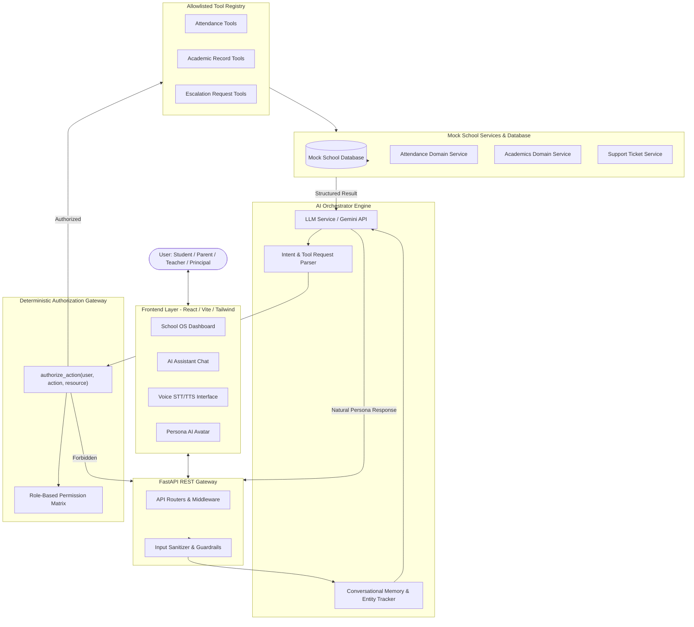

# EduSaathi Architecture & Technical Design

## 1. High-Level Architecture Overview

EduSaathi adopts a layered, deterministic, and modular architecture designed specifically for educational institutions. The system cleanly separates:
1. Presentation & Interaction (React + Tailwind CSS, Voice STT/TTS, AI Avatar)
2. API & Security Gateway (FastAPI, Input Sanitization, Rate Limiting)
3. AI Orchestration & Context Management (Gemini / LLM Service, Multi-turn Context Memory, Persona Formatter, Multilingual Engine)
4. Deterministic Authorization Barrier (`authorize_action(user, action, resource)`)
5. Tool Registry & Allowlisted Capabilities
6. Domain Services & Mock School Data (Attendance, Academics, Escalation)

---

## 2. Deterministic Authorization Model (Zero-Trust LLM)

A key architectural rule in EduSaathi is that **the LLM is never the final authority for permissions or database mutations**.

1. **User Identity Binding**: When a request is made, the session/context provides the authenticated user role and ID.
2. **Pre-Execution Hook**: Before calling any protected tool (e.g., `mark_attendance`, `get_child_attendance`), the tool runner passes `(authenticated_user, action_name, target_resource)` to `authorize_action()`.
3. **Execution Gate**: If `authorize_action()` returns false, the tool is never executed, and a structured authorization failure is returned to the AI engine to generate an informative and courteous refusal.

---

## 3. Persona System

EduSaathi dynamically adapts tone, detail level, and capabilities based on the authenticated role:

| Role | Persona Name | Tone | Capabilities |
|---|---|---|---|
| **Student** | EduSaathi Academic Assistant | Encouraging, friendly, student-focused | View personal attendance, grades, assignments, subject help |
| **Parent** | EduSaathi Parent Support Assistant | Caring, patient, reassuring | View child's attendance & grades, request teacher calls |
| **Teacher** | EduSaathi Teaching Assistant | Efficient, professional, organized | Mark class attendance, review student roster, trigger alerts |
| **Principal** | EduSaathi Management Assistant | Executive, concise, data-driven | School-wide attendance analytics, management escalations |

---

## 4. Multilingual & Voice Integration

- **Language-Agnostic Tooling**: Tool arguments and backend APIs operate in standardized schema (English keys/IDs).
- **Multilingual Persona Engine**: The LLM seamlessly processes prompts in 11 Indian languages (Hindi, Marathi, Tamil, Telugu, Bengali, Gujarati, Punjabi, Kannada, Malayalam, Urdu, English) and generates responses in the user's preferred language while interacting with the exact same underlying tools.
- **Voice Pipeline**: Audio is captured via browser Web Speech STT, piped into the orchestrator, and read back via localized TTS.
